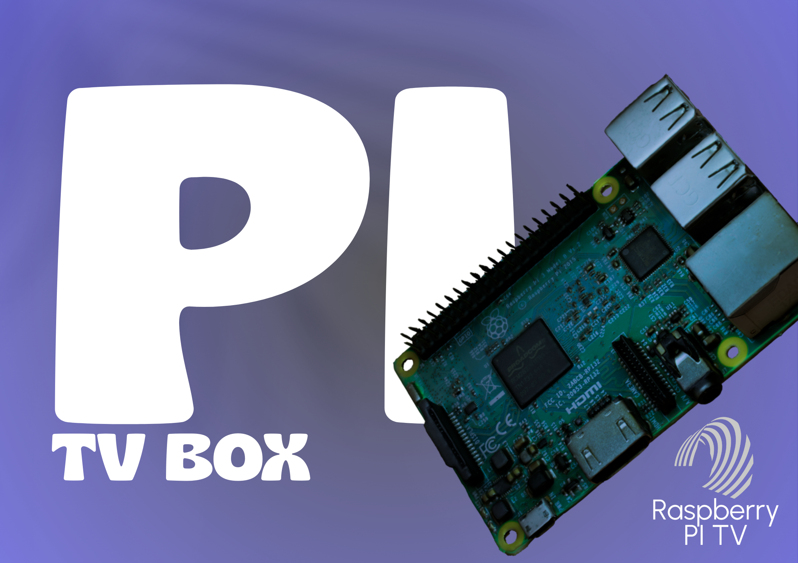

# PI Tv Box 🟣

> **Profesorski projekt multimedialnego TV-Box'a na Raspberry Pi**
> 
> AirPlay | Google Cast | Kodi | Android TV UI | HDMI-CEC | Pilot UPC

---



<p align="center">
  
  
</p>

---

## ✅ Co to jest?

PI Tv Box to projekt systemu multimedialnego dla Raspberry Pi, który daje Ci:

- AirPlay Audio & Video
- Google Cast (YouTube Cast)
- DLNA / UPnP
- Interfejs jak w Android TV (Kodi)
- Obsługę pilota UPC przez HDMI-CEC
- Autostart jak prawdziwy TV Box bez klawiatury

---

## 🚦 Postęp Projektu

```
Raspberry Pi OS Setup   [##########] 100%
AirPlay Audio           [##########] 100%
AirPlay Video           [##########] 100%
Google Cast Audio       [#####.....] 50%
Google Cast Video       [#####.....] 50%
Kodi                    [##########] 100%
Android TV Skin         [##########] 100%
Autostart Kodi          [##########] 100%
Pilot UPC (HDMI-CEC)    [##########] 100%
Konfigurator online     [##........] 20%
Instalator 1-click      [##........] 20%
```

---

## 🟣 Minimalne Wymagania

- Raspberry Pi 3B / 3B+ / 4
- Raspberry Pi OS (32-bit) with Desktop
- Karta SD 16GB+
- Myszka & Ekran (do konfiguracji)
- Opcjonalnie pilot UPC

---

## 💡 Polecana Skórka Kodi
- `Aura` lub `Estuary MOD V2` — idealna pod styl Android TV

---

## 📘 Dokumentacja
> Pełna dokumentacja i konfigurator znajdziesz wkrótce na **GitBook** projektu: [Kliknij tutaj](https://github.com/majnek321/PI-Tv-Box/wiki) 🟣

---

## Licencja
[MIT License](LICENSE)

---

## 💎 Autor
**Michał // majnek321**  
Zaprojektowane z pasją przez Profesora 🤍
