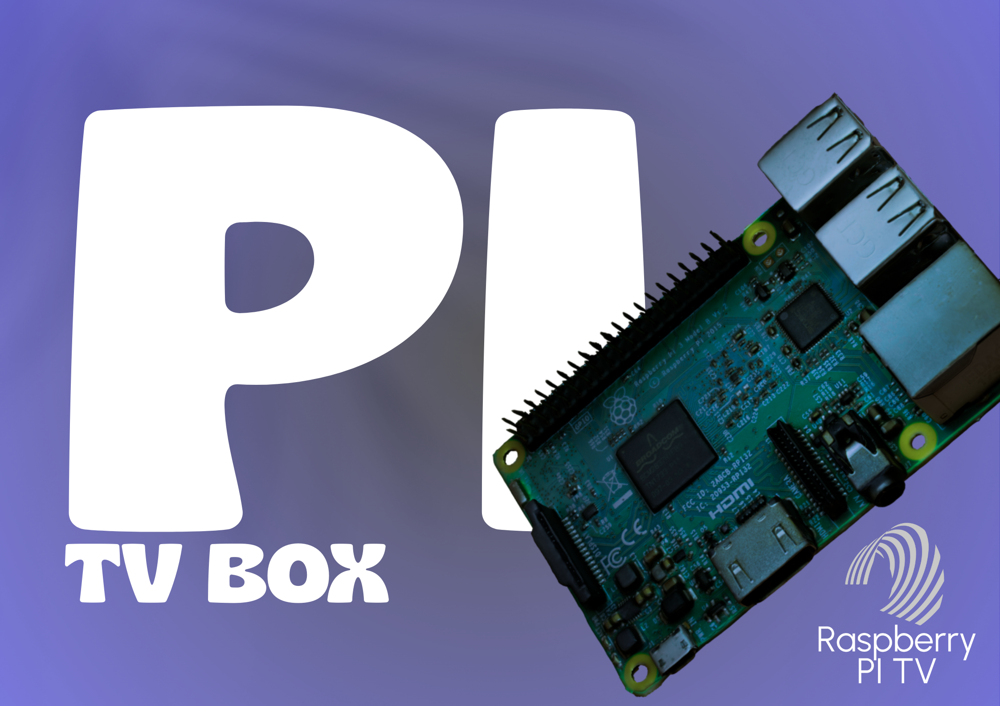

# PI Tv-Box



Tworzymy własny **TV-Box** na bazie Raspberry Pi OS z funkcjami:


---

## ✅ Funkcje projektu:
- AirPlay Audio i Video
- Google Cast (YouTube i inne)
- DLNA / UPnP Receiver
- Interfejs przypominający Android TV (Kodi + skórka)
- Autostart bez klawiatury
- Pilot UPC przez HDMI-CEC

---

## 📦 Wymagania sprzętowe
- Raspberry Pi 3B / 3B+ / 4
- Raspberry Pi OS (32-bit) with Desktop
- Karta SD 16GB+
- Myszka i ekran do konfiguracji
- Opcjonalnie: pilot z CEC (np. UPC)

---

## 💿 Instalacja systemu
1. Pobierz: https://www.raspberrypi.com/software/operating-systems/
2. Wypal przez Raspberry Pi Imager na kartę SD
3. Skonfiguruj sieć i system

---

## ⚙️ Instalacja oprogramowania

```bash
sudo apt update && sudo apt full-upgrade -y
sudo apt install kodi shairport-sync git pulseaudio pavucontrol python3-pip libcec-dev ffmpeg
pip3 install mkchromecast
```

---

## 🚀 Autostart Kodi

```bash
sudo nano /etc/xdg/lxsession/LXDE-pi/autostart
```

Dodaj na końcu:
```
@kodi
```

---

## 📡 Autostart MkChromecast (Google Cast)

```bash
nano ~/.config/lxsession/LXDE-pi/autostart
```

Dodaj:
```
@mkchromecast --video --encoder-backend ffmpeg
```

---

## 🟣 AirPlay Audio
```bash
sudo systemctl enable shairport-sync
sudo systemctl start shairport-sync
```

Pi stanie się AirPlay Speaker

---

## 🟡 Pilot przez HDMI-CEC
1. Otwórz Kodi
2. Ustawienia > System > Wejście > CEC > Włącz
3. Skonfiguruj przyciski pilota

---

## 💡 Polecana skórka Kodi:
- Skórka: `Aura` lub `Estuary MOD V2`
- Interfejs jak Android TV

---

# Efekt finalny
Po włączeniu:
- Automatyczne uruchamianie Kodi
- Obsługa AirPlay i Cast
- Pilot UPC steruje Kodi
- Pi działa jako domowy TV Box

---

> Projekt otwarty, chętnie przyjmujemy pomysły i pull requesty!
